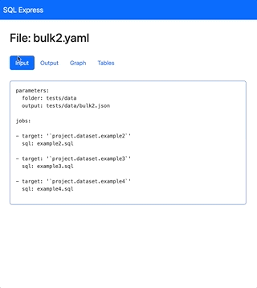
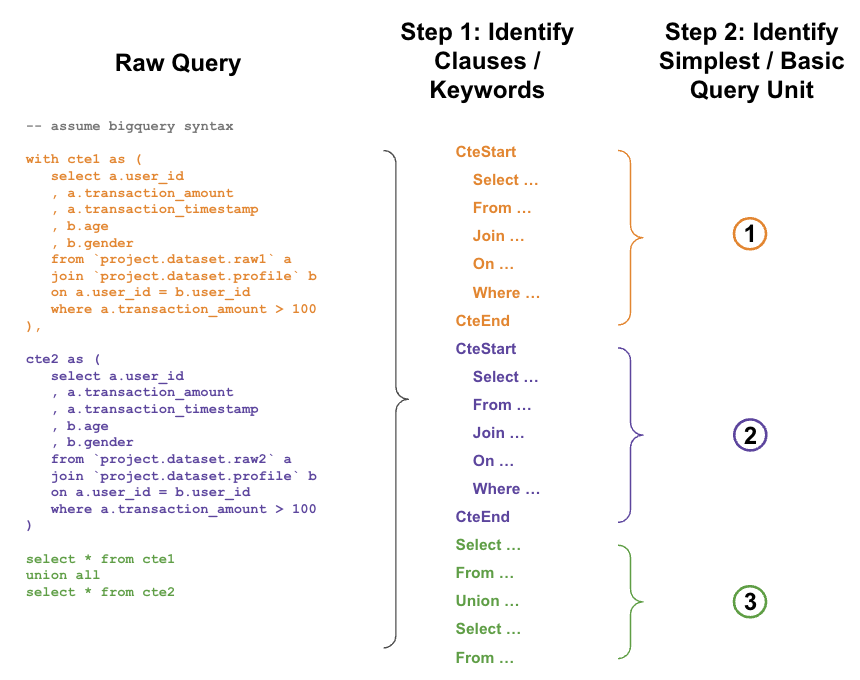
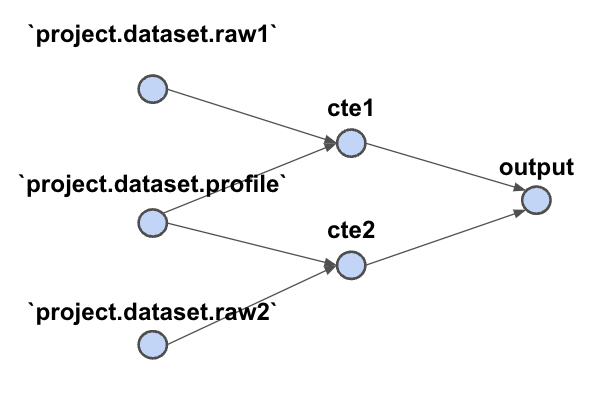

# SQL Express

## Introduction

How often do you find yourself in the following situation:
- Having tons of SQL files to maintain
  - E.g. trust & safety teams with many rules written in SQL
  - E.g. data engineering teams with many ETL jobs written in SQL
- No time to read & understand the logic of every single SQL
  - E.g. each SQL could be up to 1000s of lines long
  - E.g. logic could be complicated & not well documented
- Struggle with data quality issues
  - E.g. output has issue because source tables have issue / missing data
- Struggle with query optimization
  - E.g. SQLs may contain repeated logic that can be combined to save cost & money

Wouldn't it be nice if there is a package that can:
- Summarize the logic of your SQLs
- Perform data sanity checks on the required source tables
- Identify repeated logics across your SQLs

Given a single SQL file, this package is designed to:
- Parse query structure
- Extract source tables
- *< more to come >*

Given multiple SQL files, this package is further designed to:
- Bulk perform all functionalities listed above
- Visualise relationship between source & output tables across SQLs
- *< more to come >*


## Getting Started

### Installation

```bash
pip install sqlexpress
```

### Single SQL File

Using command line:

```bash
# print query structure
python3 -m sqlexpress structure -f tests/data/example1.sql

# print source tables
python3 -m sqlexpress sources -f tests/data/example1.sql
```

Using python:

```python
from sqlexpress.parsers import QueryParser
query = open('tests/data/example1.sql', 'r').read()
parser = QueryParser(query)

# print query structure
parser.print()

# get source tables
source_tables = parser.extract_sources()  # ['`project.dataset.raw1`', ...]
```

### Multiple SQL Files

Firstly, create a yaml file containing details of the SQL files 
([example](tests/data/bulk2.yaml)).

Using command line:

```bash
# process yaml file
python3 -m sqlexpress bulk -f tests/data/bulk1.yaml

# visualize relationships between tables
export WEBSERVER_FOLDER=tests/data  # folder containing yaml files
python3 -m sqlexpress webserver     # start web server
```

Extracted details are stored in a json file 
([example](tests/data/bulk2.json)).

## Web Server

### Installation

```bash
pip install sqlexpress[web]
```

### Home page

Shows all yaml files inside `WEBSERVER_FOLDER`.
- Click on `Extract` button to process yaml file.
- Click on file name to jump to project page.


### Project page

Shows the following details:
1. **Input** - Contents of yaml file
2. **Output** - Contents of json file
3. **Graph** - Visualisation of source & output tables
4. **Table**: List all tables extracted from SQLs



## Under The Hood

Want to identify the structure of the query first so that it is easier
to identify other things (e.g. source tables). This is done in 2 steps:



With the parsed structure, we can construct a directed table graph (below) 
even with long, complicated queries. The source tables can be easily 
identified from the table graph (nodes with only outward arrows).




